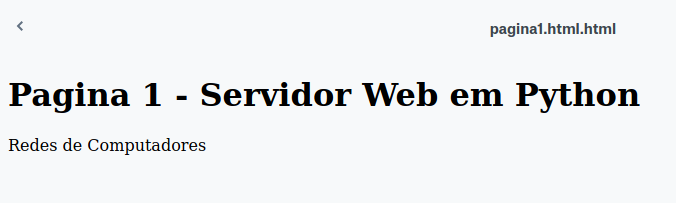

A simple project made to support simple HTML pages without any media and for Windows only, using Sockets library and Python 3 language. 
 
Source: <a href="https://github.com/Diolante/Servidor-Web-Simples-em-Python"><i class="large github icon"></i>A simple Python Web Server</a>
