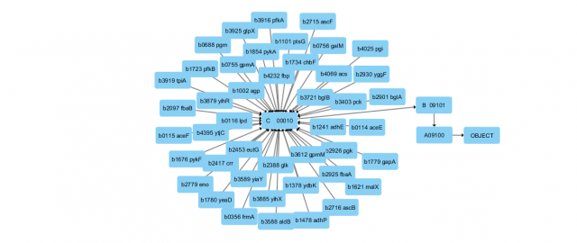

A tool developed as part of an undergraduate research project by CNPq and UTFPR, that is still ongoing, where given any organism the tool is capable of build the 
hierarchic acyclic graph that is used to calculate the similarity of two genes in any place in the graph.

The libraries and tools used are, Python 3, IGraph and Cytoscape (To visually generate the graph from a file create by the built tool),
also a file from an organism provided by Kyoto Encyclopedia of Genes and Genomes is needed.

The methodology and equations are still classified.
 
