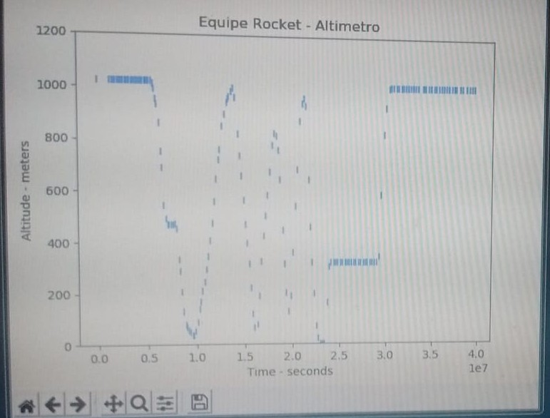

A ground receiver developed in Python 3, to receive serial data, save in a .txt and plot realtime values from the rocket altimeter powered by an arduino, 
the libraries used are MatPlotLib, pySerial and Threads (not entirely necessary, but implemented). Also there is no UI for the user, only through
command line.

Source: <a href="https://github.com/Diolante/Basic-Ground-Receiver"><i class="large github icon"></i>Basic Ground Receiver</a>

 
