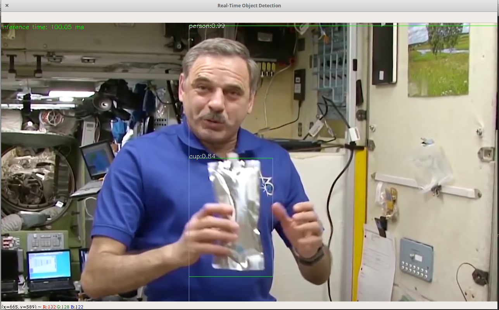

The YoloV3 uses a CNN Architecture called Darknet-53 an evolution from YoloV2 architecture Darknet-19, and this algorithm uses an 80 classes trained model from ImageNet, 
that can be found in the second reference in the github link, this algorithm do only the inference through the model.

Source: <a href="https://github.com/Diolante/YoloV3-Darknet-Multi-Object-Detection-and-Classification"><i class="large github icon"></i>Basic Ground Receiver</a>

 
