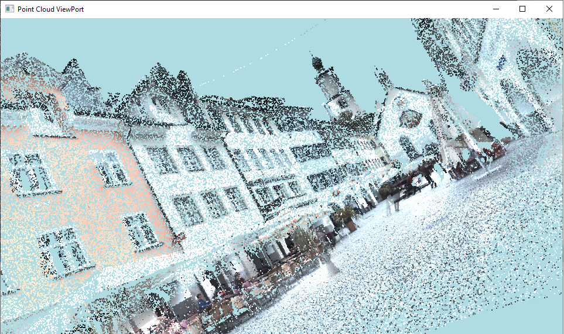

  

A basic point cloud viewer, made with C++11 and powered by modern OpenGL, is capable of loading and generate a 
visualization from small to large point cloud datasets, also is able to highlight points with colors (RGB).

The main objetive of this personal project was train myself in C++ language, aiming to refine my skills. 

The Point-Cloud shown in the banner, is part of a dataset provided in the website: <a href="https://semantic3d.net"><i class="large github icon"></i>Semantic 3D</a>

Source: <a href="https://github.com/Diolante/Simple-PointCloud-Viewer"><i class="large github icon"></i>Basic Point Cloud Viewer</a>

